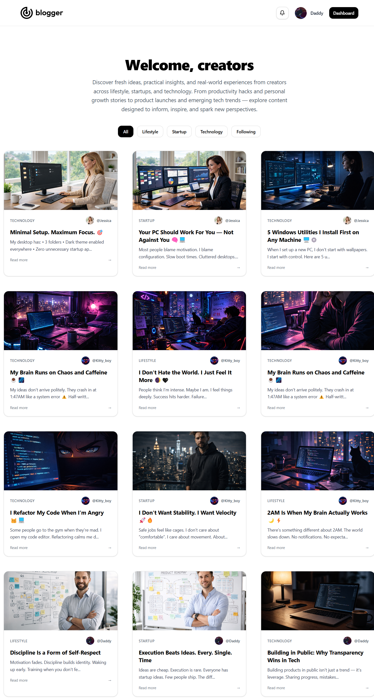
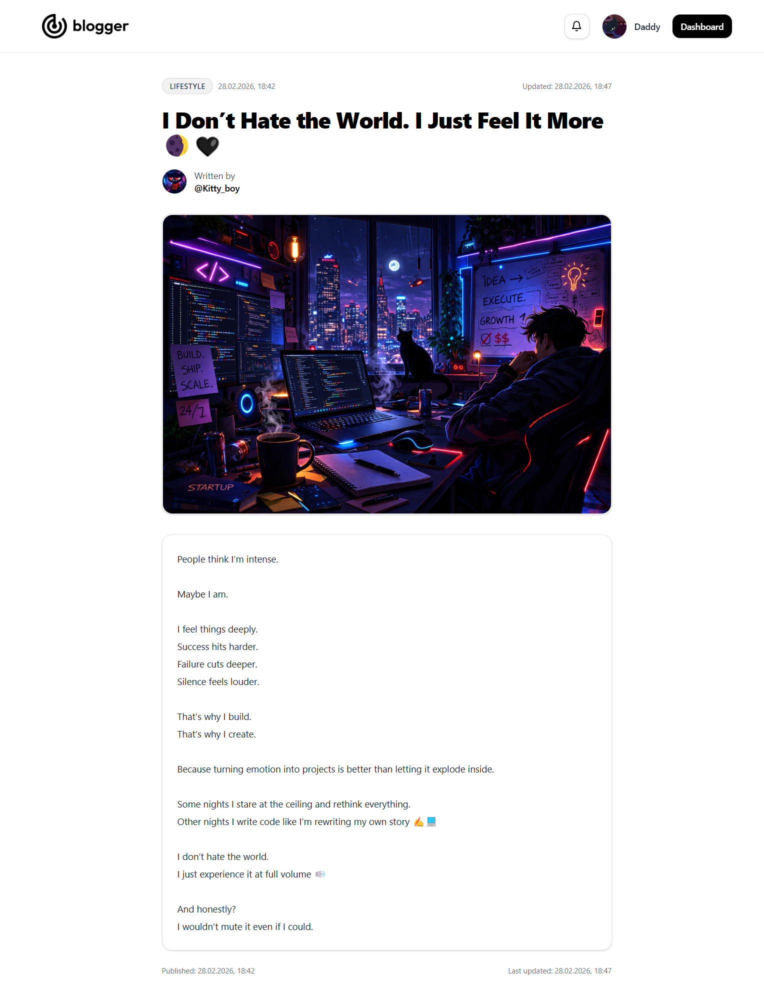
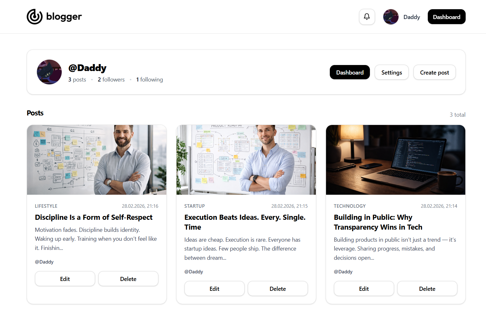
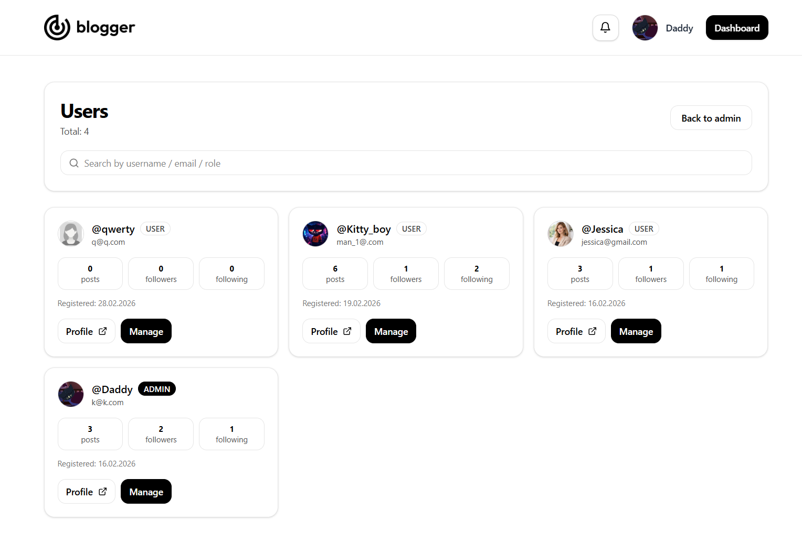
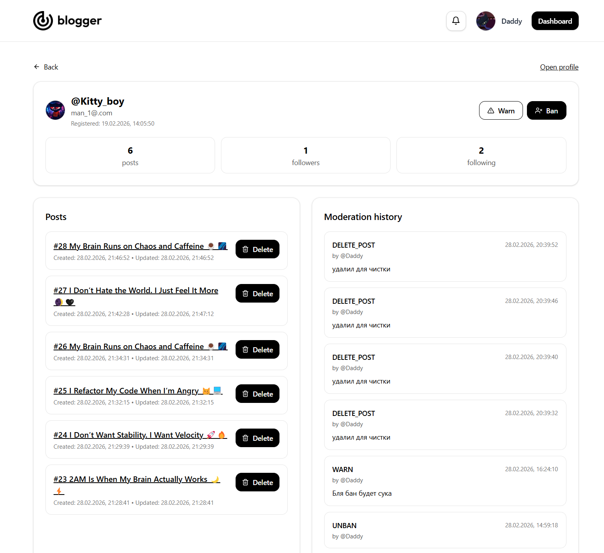

# Blogger 📝 — full-stack блог-платформа (Next.js + Prisma + Postgres)

## 🌍 Production / Vercel

**Сайт в проде:** https://websiteblogger.vercel.app/  
Деплой сделан на **Vercel**, проект доступен всем по ссылке (ПК/телефон/планшет).

---

## 🖼️ ВАЖНО ПРО КАРТИНКИ (прочитай!)

⚠️ **ВАЖНО: загрузка/просмотр изображений может зависеть от региона.**  
Картинки отдаются через внешнюю файловую инфраструктуру (UploadThing / ufs.sh и т.п.).  
В некоторых регионах для стабильной загрузки изображений может понадобиться **специальное ПО для корректного соединения**.  
**Без него изображения могут не прогружаться или работать нестабильно.**

---

## 🚀 Деплой и инфраструктура

- **Hosting / Serverless:** Vercel (Next.js App Router)
- **Database:** PostgreSQL (Neon)
- **ORM:** Prisma
- **Auth:** JWT в **httpOnly cookies**
- **Uploads:** UploadThing (два токена: посты / аватары)
- **Notifications:** серверные уведомления (иконка 🔔 в Navbar)

---

## 🧠 Функциональность (что умеет сайт)

### 👤 Аккаунт и авторизация
- Регистрация и вход
- JWT хранится в `httpOnly` cookie `token`
- Проверка текущего пользователя: `GET /api/auth/me`
- Выход: `POST /api/auth/logout`

### 📝 Посты
- Создание поста (с картинкой/без)  
  `POST /api/posts`
- Просмотр поста по ссылке `/posts/[post_id]`
- Редактирование поста `/posts/[post_id]/edit`
- Удаление поста владельцем или админом  
  `DELETE /api/posts/[postId]`
- Если у поста была картинка (UploadThing key) — при удалении она удаляется из хранилища

### 🏷 Категории
- Категории хранятся в БД (`Category`)
- Пост может быть привязан к категории

### 👥 Подписки (Follow / Unfollow)
- Подписаться / отписаться на пользователя  
  `POST /api/follow` / `DELETE /api/follow?username=...`
- Страницы:
  - `/u/[username]` — профиль
  - `/u/[username]/followers` — подписчики
  - `/u/[username]/following` — подписки

### 📰 Лента подписок (Following Feed)
- `/followingFeed` — лента постов пользователей, на которых ты подписан

---

## 🔔 Уведомления (колокольчик в Navbar)

Уведомления лежат в таблице `Notification` и отображаются в выпадающем списке по клику на 🔔.

### Какие уведомления приходят
- **NEW_POST** — когда человек, на которого ты подписан, публикует новый пост  
  (создаётся в `POST /api/posts`)
- **WARN** — предупреждение от админа
- **BAN** — бан от админа
- **UNBAN** — разбан от админа
- **DELETE_POST** — админ удалил пост (с причиной или без)

### Эндпоинты уведомлений
- `GET /api/notifications` — список + количество непрочитанных
- `POST /api/notifications/read` — отметить всё прочитанным
- `POST /api/notifications/clear` — очистить все уведомления

---

## 🛡 Админ-возможности (ADMIN)

Админ может делать модерацию через server routes:

### ✅ Действия
- **WARN user**  
  `POST /api/admin/users/warn` (с reason)
- **BAN user**  
  `POST /api/admin/users/ban` (с reason)
- **UNBAN user**  
  `POST /api/admin/users/unban`
- **DELETE чужой пост**  
  `POST /api/admin/posts/delete` (опционально с reason)

### 🔒 Защиты от “шалостей” (встроено в код)
- админ **не может** банить самого себя
- админ **не может** банить/варнить другого админа
- админ **не может** модерировать **свой** пост (в delete-роуте стоит защита)
- при бане пользователю ставится `isBanned=true`, а при логине выставляется cookie `banned=1`
- middleware (`src/middleware.ts`) редиректит забаненного на `/banned`

---

## ⚙️ Настройки аккаунта (Settings)
Страница: `/settings`

API:
- `PATCH /api/users/update-profile` — обновление `username/email/avatar`
- `POST /api/users/change-password` — смена пароля

---

## 📦 Переменные окружения (ENV)

Минимально необходимые:

- `DATABASE_URL` — строка подключения к PostgreSQL (Neon)
- `JWT_SECRET` — секрет для подписи JWT
- `UPLOADTHING_TOKEN_POST` — токен UploadThing для загрузки картинок постов (`/api/uploadthing`)
- `UPLOADTHING_TOKEN_AVATAR` — токен UploadThing для загрузки аватарок (`/api/uploadthing-avatar`)

> ⚠️ Никогда не коммить `.env` в репозиторий.

---

## 🧱 Prisma / База данных

Схема: `prisma/schema.prisma`

Основные модели:
- `User` (роль `USER/ADMIN`, бан-поля `isBanned/banReason/bannedAt`)
- `Post` (id = `post_id`, картинка `img_post` и `imgPostKey`)
- `Category`
- `Follow`
- `Notification`
- `ModerationAction` (WARN/BAN/UNBAN/DELETE_POST)

---

## 🧪 Локальный запуск

1) Установить зависимости:
npm install

Настроить .env (локальная БД или Neon)

Применить миграции:
npx prisma migrate dev

Запуск:
npm run dev

---

## 🖼 Скриншоты (места под базовые)

> Создай папку `./screenshots/` и положи туда изображения с такими именами.

### 1) Главная (лента / категории / посты)

### 2) Страница поста

### 3) Профиль пользователя 

### 4) Админ-возможности (пример: warn / ban / delete post)

---

## 📌 Мелочи, которые стоит знать

- В проекте есть middleware (`src/middleware.ts`) для редиректа забаненных пользователей.
- В `next.config.ts` настроены `images.remotePatterns` под домены UploadThing / ufs.sh и другие внешние источники.
- В `package.json` есть `postinstall: prisma generate` (важно для Vercel).
- Production база размещена в Neon (PostgreSQL).
- JWT хранится в httpOnly cookie и проверяется сервером.
- Role-based доступ (USER / ADMIN) валидируется на backend.

---

## ✅ Итог

Это production-ready full-stack платформа с:

- постами + загрузкой изображений
- подписками (Follow / Unfollow)
- системой уведомлений (🔔)
- ролями (USER / ADMIN)
- админ-модерацией (warn / ban / unban / delete post)
- настройками профиля и пароля
- PostgreSQL + Prisma + Neon
- деплоем на Vercel

**Live:** https://websiteblogger.vercel.app/